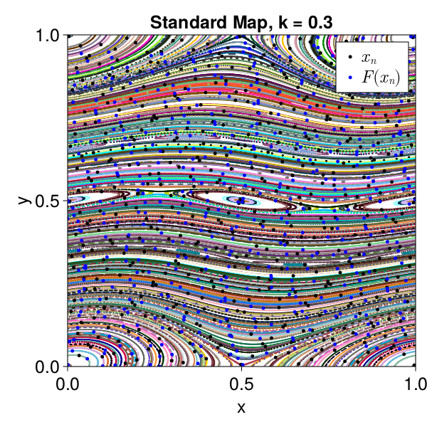
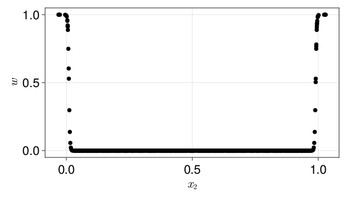
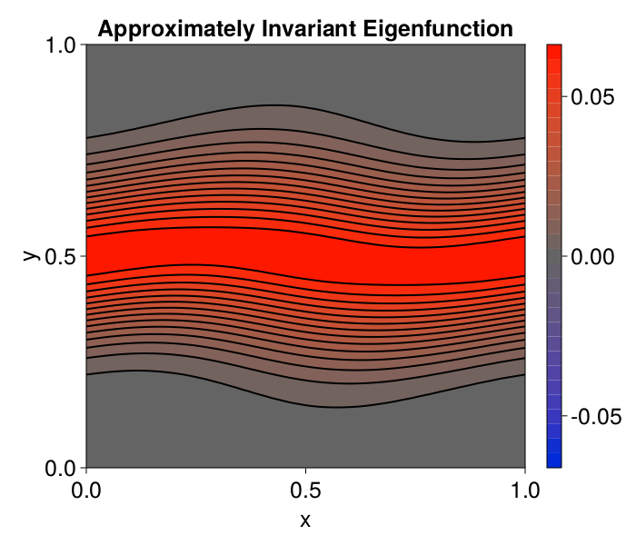
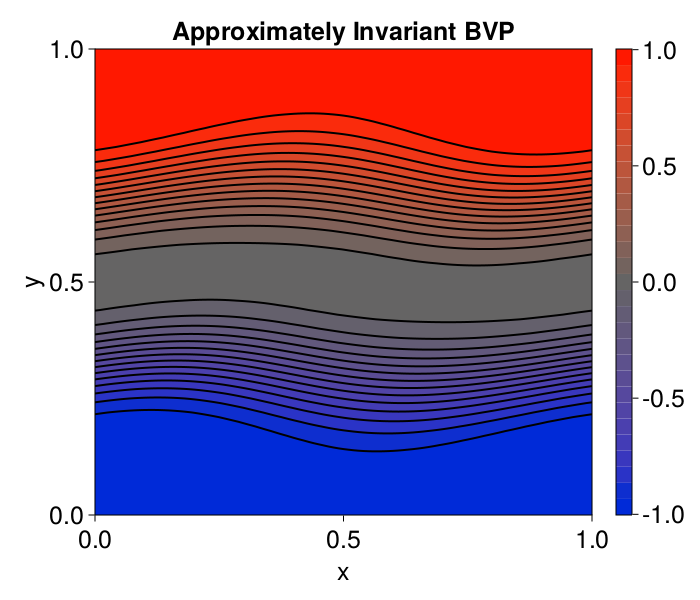

```@meta
EditURL = "../../../kernel.jl"
```

# Kernel Method for Finding Invariant Circles

Here, we will show examples of the `kernel_eigs` and `kernel_bvp` functions,
which find approximately invariant functions of a symplectic map. To be more
specific, let $F : \Omega \to \Omega$ be a symplectic map. An approximately
invariant function $h$ is one that satisfies
```math
\lVert h\circ F - h \rVert \ll \lVert h \rVert,
```
for some norm. We find the function $h$ by discretizing it via kernels, i.e. for
a positive (semi)definite kernel $K : \Omega \times \Omega \to \mathbb{R}$, we
define the kernel function on the data $y_n \in \Omega$ as
```math
h(x) = \sum_{n = 1}^{2N}c_n K(x, y_n).
```
For the points $y_n$, we first sample a sequence $x_1, x_2, \dots, x_N$ in some
domain $U \in \Omega$. Then, we evaluate $F(x_n)$, giving the sequence
$y_1 = x_1$, $y_2 = F(x_1)$, $y_3 = x_2$, $y_4 = F(x_2)$, etc.

`SymplecticMapTools` comes equipped with sampling schemes for rectangular
domains. Consider the symplectic map:

````julia
using SymplecticMapTools
using CairoMakie
using LinearAlgebra
````

````julia
k_sm = 0.3;
F = standard_map_F(k_sm);

N = 500
xb = [0., 1.]
yb = [0., 1.]
xs = kernel_sample_F(F, N, xb, yb);
ylims = yb
f, xs_pp = SymplecticMapTools.poincare_plot([0,1], [0,1], F, N, 500; ylims, resolution=(600, 600),
                         title="Standard Map, k = $(k_sm)")
ax = contents(f[1, 1])
plot!(xs[1,1:2:end], xs[2,1:2:end], color=:black, markersize=7, label=L"x_n")
plot!(xs[1,2:2:end], xs[2,2:2:end], color=:blue, markersize=7, label=L"F(x_n)")
axislegend()

f
````


Above is a Poincare plot of the standard map with $k = 0.3$, along with the
points $y_n$ used for the kernel method. Now, to apply the method, we also need
weights for boundary conditions $w_{\mathrm{bd}}:\Omega \to \mathbb{R}$. The
boundary condition weight function should be equal to $1$ where you want to
enforce boundary conditions, and $0$ where you do not. It is typically best for
it to be chosen smooth in between as well. One good option for this is to use a
sum of logistic functions. A simple version of this is implemented in
`window_weight` for maps in $\mathbb{T} \times \mathbb{R}$ and
`rectangular_window_weight` for maps in $\mathbb{R}^2$:

````julia
lims = [0.01, 0.99]; # window size, includes the boundaries
α = 0.002;           # Transition length scale
w = window_weight(xs, lims, α)

resolution = (700, 400); fontsize=25;
f = Figure(;resolution, fontsize)
ax = Axis(f[1,1], xlabel=L"x_2", ylabel=L"w")
plot!(xs[2, :], w)

f
````


The above plot shows how the weighting applys to the vertical component. We see we are
applying our boundary conditions at the top and bottom, but not in the
interior. Now, we have enough information to call `kernel_eigs` to find an
approximately invariant function. It does this by minimizing the following
Rayleigh quotient:
```math
\lambda = \min_c \frac{ E_{\mathrm{Inv}} + E_{\mathrm{bd}} + E_{\mathrm{K}} }{E_{L^2}},
```
where
```math
E_{\mathrm{Inv}} = \sum_{n = 1}^N (h(y_{2n-1}) - h(y_{2n}))^2 = \sum_{n = 1}^N (h(x_n) - h(F(x_n)))^2
```
is an energy that forces $h$ to be approximately invariant,
```math
E_{\mathrm{bd}} = \sum_{n=1}^{2N} w_{\mathrm{bd}}(y_n) h(y_n)^2
```
is the a penalty on nonzero boundary conditions,
```math
E_{\mathrm{K}} = \sum_{n, m = 1}^{2N} K(y_n, y_m) c_n c_m
```
is a kernel norm encouraging smooth solutions, and
```math
E_{L^2} = \sum_{n = 1}^{2N} h(y_n)^2
```
is the $L^2$ norm of the function. We note that the eigenvalue problem is
useful to get a nonzero solution (simply minimizing the numerator would give
$h = 0$ regardless of the map, a decidedly unhelpful function).

We can see an output approximately invariant function in the following block:

````julia
ϵ = 1e-8 # Weight of regularization. Should be small and nonzero
nev = 1  # Number of eigenvalues/eigenvectors to find
σ = 0.25 # Length scale of the kernel
kernel = :FourierSE # Product kernel that is periodic sine squared exponential in x and squared exponential in y

λs, vs, k = kernel_eigs(xs, ϵ, nev, σ, w; kernel)
println("The returned eigenvalue is λ = $(λs[1])")
f, f_grid = plot_on_grid(0:0.01:1, 0:0.01:1, k; levels=30,
                         resolution=(700, 600), xlabel="x", ylabel="y",
                         title="Approximately Invariant Eigenfunction")
f
````


Qualitatively, we see the contours of the label function matches the Poincare
plot well. Additionally, the value of $\lambda$ tells us that
$E_{\mathrm{Inv}} \ll E_{L^2}$, which is the discretization of our definition
of an approximately invariant function.

We can find such a plot without an eigenvalue solve as well using a boundary
value problem. For this, we require a boundary value function
$h_{\mathrm{bd}} : \Omega \to \mathbb{R}$. Given this, the boundary value
problem is phrased as
```math
R = \min_c (E_{\mathrm{Inv}} + E_{\mathrm{bd,h}} + \epsilon E_{\mathrm{K}}),
```
where
```math
E_{\mathrm{bd, h}} = \sum_{n=1}^{2N} w_{\mathrm{bd}}(y_n) (h(y_n) - h_{\mathrm{bd}}(y_n))^2
```
is the new boundary condition energy. The boundary values give a different
method by which the label function is forced to be nonzero. Typically, the
boundary value problem is useful when you want to know if circles foliate a
certain annulus.

We can apply this method using the function `kernel_bvp`:

````julia
hbd = [xi[2] > 0.5 ? 1. : -1. for xi = eachcol(xs)]
k, R, E_bd, E_inv, E_K = kernel_bvp(xs, ϵ, σ, w, hbd; kernel)
hs = evaluate(k, xs)
println("R     = $R,
E_bd  = $(E_bd),
E_inv = $(E_inv),
E_K   = $(E_K),
E_L2  = $(hs'*hs)")
f, f_grid = plot_on_grid(0:0.01:1, 0:0.01:1, k; levels=30,
                         resolution=(700, 600), xlabel="x", ylabel="y",
                         title="Approximately Invariant BVP")
f
````


Again, we see a very similar invariant function, with
$E_{\mathrm{Inv}} \ll E_{L^2}$.

---

*This page was generated using [Literate.jl](https://github.com/fredrikekre/Literate.jl).*

